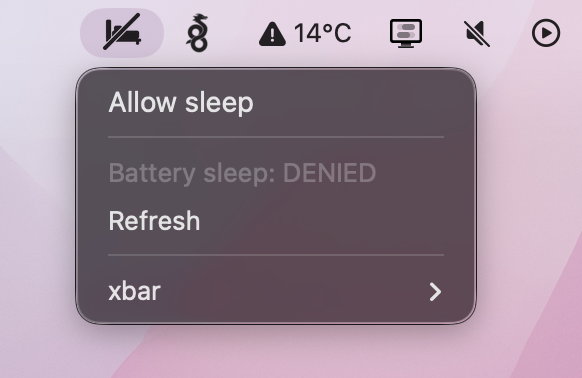

# Disable sleep

Menu bar toggle for disabling/enabling sleep, even when laptop fully closed.



## Setup

### 1. Install xbar

Install [xbar](https://xbarapp.com/) (free menubar toolkit). For example with Homebrew:

```bash
brew install --cask xbar
```

Launch xbar once so it creates its plugins folder (`~/Library/Application Support/xbar/plugins`).

### 2. Install this plugin

Run `install.sh` — clones this repo into `./xbar-plugins` and symlinks the plugin into xbar's folder:

```bash
curl -fsSLO https://raw.githubusercontent.com/kiprasmel/xbar-plugins/refs/heads/main/System/disable-sleep/install.sh
# optionally inspect install.sh, then:
bash install.sh
```

Note: first time setup will ask for sudo password, to allow running `sudo pmset` (toggle sleep) without password. If you skip that prompt, your first menubar click will offer to install it instead.

## Modify / update

The plugin script lives at `./xbar-plugins/System/disable-sleep/disable-sleep.10s.sh`. Edit it in place — xbar reloads it on its 10s tick.

Update to the latest version:

```bash
cd xbar-plugins && git pull
```

If you fork the repo, specify when installing:

```bash
REPO=youruser/xbar-plugins bash install.sh
```

## Uninstall

```bash
./xbar-plugins/uninstall.sh
```

Removes the symlink from xbar's plugins folder. The git clone is left in place.
